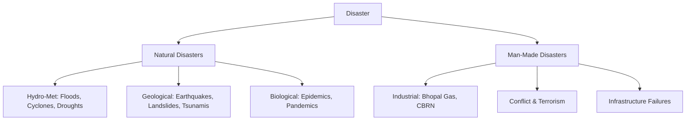
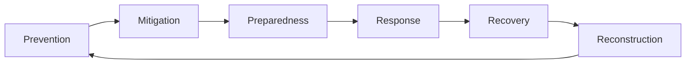

# Disaster Management

## 1. Disaster — Definition & Classification

### Definition (Disaster Management Act, 2005):
A **disaster** is a catastrophe, mishap, calamity or grave occurrence in any area, arising from natural or man-made causes, or by accident or negligence which results in substantial loss of life or human suffering or damage to, and destruction of, property.

### Classification:

---

## 2. Legal & Institutional Framework

### Disaster Management Act, 2005:
- The **apex legislation** for disaster management in India, enacted post the 2004 Indian Ocean Tsunami.
- Established:
  - **NDMA (National Disaster Management Authority)**: Chaired by the **Prime Minister**. Sets policies and guidelines.
  - **SDMA (State Disaster Management Authority)**: Chaired by the **Chief Minister**.
  - **DDMA (District Disaster Management Authority)**: Chaired by the **District Collector / DM**.
  - **NDRF (National Disaster Response Force)**: 16 battalions of specialised disaster response forces.

### Key Bodies:

| Body | Role |
| :--- | :--- |
| **NDMA** | Policy, guidelines, coordination |
| **NEC (National Executive Committee)** | Chaired by Home Secretary; coordinates central ministries |
| **NDRF** | Rapid response force; 16 battalions; under NDMA |
| **SDRF (State Disaster Response Force)** | State-level counterpart of NDRF |
| **IMD (India Meteorological Department)** | Weather forecasting, cyclone tracking |
| **INCOIS (Indian National Centre for Ocean Information Services)** | Tsunami early warning system; HQ Hyderabad |

> 💡 **EXAM TRAP**: NDMA is chaired by the **Prime Minister**, not the Home Minister. The Home Secretary chairs the **National Executive Committee (NEC)**.

---

## 3. Disaster Management Cycle

| Phase | Description |
| :--- | :--- |
| **Prevention** | Eliminating the risk entirely (e.g., ban on construction in flood plains) |
| **Mitigation** | Reducing the impact (e.g., building earthquake-resistant structures, cyclone shelters) |
| **Preparedness** | Training, mock drills, early warning systems, stockpiling |
| **Response** | Immediate actions during disaster (rescue, relief, NDRF deployment) |
| **Recovery** | Restoring essential services (short-term) |
| **Reconstruction** | Long-term rebuilding, "Build Back Better" approach |

---

## 4. Major Disasters in India — Context

### Cyclones (AP-Specific):
- AP has one of the most cyclone-prone coastlines in India (Bay of Bengal).
- **Hudhud (2014)**: Hit Visakhapatnam; one of the most destructive. Category 5.
- **Phailin (2013)**: Hit Odisha/AP border.
- **Cyclone Warning**: IMD issues alerts. INCOIS monitors sea conditions.
- **Cyclone Shelters**: AP has constructed thousands of multi-purpose cyclone shelters.

### Earthquakes:
- **Seismic Zones of India (BIS)**:
  - Zone V (Very High Risk): J&K, Uttarakhand, NE India, Gujarat (Kutch)
  - Zone IV (High Risk): Delhi, Bihar, large parts of Himachal Pradesh
  - Zone III (Moderate): AP largely falls here
  - Zone II (Low Risk): South AP (Rayalaseema), Deccan plateau interior

### Major Historical Disasters:
| Disaster | Year | Key Fact |
| :--- | :--- | :--- |
| Latur Earthquake | 1993 | 10,000+ deaths; Maharashtra |
| Orissa Super Cyclone | 1999 | 10,000+ deaths; worst cyclone |
| 2001 Bhuj Earthquake | 2001 | 20,000+ deaths; Gujarat |
| 2004 Indian Ocean Tsunami | 2004 | 9.1 Richter; AP coastline heavily hit |
| 2013 Uttarakhand Floods | 2013 | Cloud burst; 5,000+ deaths |
| 2019 Fani Cyclone | 2019 | Category 5; Odisha — best-ever evacuation |

---

## 5. Sendai Framework (2015–2030)

- **Full Name**: Sendai Framework for Disaster Risk Reduction 2015–2030.
- **Adopted**: March 2015 in Sendai, Japan at the World Conference on Disaster Risk Reduction.
- **Successor to**: Hyogo Framework for Action (2005–2015).

### Four Priorities for Action:
1. Understanding disaster risk.
2. Strengthening disaster risk governance to manage disaster risk.
3. Investing in disaster risk reduction for resilience.
4. Enhancing disaster preparedness for effective response and "Build Back Better."

### Seven Global Targets:
- Reduce global mortality, affected people, economic losses, critical infrastructure damage.
- Increase number of countries with national/local DRR strategies, international cooperation, and access to early warning systems.

---

## 6. Early Warning Systems

### Tsunami Warning:
- **ITEWC (Indian Tsunami Early Warning Centre)**: Established at **INCOIS, Hyderabad** in 2007. Monitors seismic activity in the Indian Ocean 24×7.

### Cyclone Warning:
- **IMD**: Issues 4-stage cyclone warnings. Uses Doppler weather radars along the coast.
- AP coast has multiple Doppler radars at Visakhapatnam, Machilipatnam.

### Flood Forecasting:
- **CWC (Central Water Commission)**: Operates flood forecasting stations across major rivers.
- Real-time data from rain gauges, river gauges, satellite imagery.

### Heat Wave Warning:
- IMD defines Heat Wave as a deviation of 4.5–6.4°C above normal temperatures (or 45°C+ in plains).
- AP and Telangana are among the most heat-wave prone states.
- **Heat Action Plans**: Many AP cities (Vizag, Guntur) have developed city-level Heat Action Plans.
