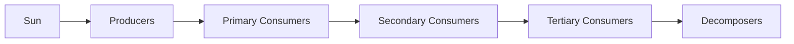

# Ecosystem & Biodiversity

## 1. Ecosystem Basics

### Definition:
An **Ecosystem** is a functional unit of nature where living organisms (biotic components) interact with each other and with their non-living environment (abiotic components) through energy flow and nutrient cycling.

### Components:
- **Biotic**: Producers (plants/algae), Consumers (herbivores, carnivores, omnivores), Decomposers (fungi, bacteria).
- **Abiotic**: Temperature, water, light, soil, minerals, pH.

### Energy Flow (Unidirectional):

- **10% Rule (Lindeman's Law)**: Only 10% of energy is transferred from one trophic level to the next. 90% is lost as heat.

### Food Chain vs. Food Web:
- **Food Chain**: Linear sequence of energy transfer.
- **Food Web**: Interconnected network of food chains (more realistic).
- **Trophic Level**: Position of an organism in the food chain.

---

## 2. Biogeochemical Cycles

### Carbon Cycle:
- Carbon is fixed by photosynthesis, released by respiration and combustion.
- **Carbon Sinks**: Oceans, forests, soil.
- **Concern**: Increased fossil fuel burning is adding excess CO₂ to the atmosphere, driving climate change.

### Nitrogen Cycle:
- **N₂ (78% of air)** is fixed by nitrogen-fixing bacteria (*Rhizobium* in legume root nodules) and lightning.
- Steps: Nitrogen Fixation → Nitrification → Assimilation → Ammonification → Denitrification.

### Phosphorus Cycle:
- No gaseous phase — sedimentary cycle.
- Key nutrient for DNA, ATP, and cell membranes.
- Main reservoir: rocks and sediments.

---

## 3. Biodiversity

### Levels of Biodiversity:
1. **Genetic Diversity**: Variety of genes within a species (enables adaptation & evolution).
2. **Species Diversity**: Variety of species in an ecosystem. Measured by **Species Richness**.
3. **Ecosystem Diversity**: Variety of ecosystems (forests, wetlands, deserts, grasslands).

### India's Biodiversity Status:
- India is one of the world's **17 Megadiverse Countries**.
- Has 4 of the world's **36 Biodiversity Hotspots**:
  1. **Western Ghats & Sri Lanka** (shared)
  2. **Eastern Himalayas** (Himalaya Hotspot)
  3. **Indo-Burma** (Northeast India)
  4. **Sundaland** (Andaman & Nicobar Islands)

> 💡 **EXAM TRAP**: India has **4** biodiversity hotspots, not 2. Many exams ask this specifically. Eastern Himalayas and Indo-Burma are separate hotspots that both cover Northeast India regions.

---

## 4. Threats to Biodiversity

### HIPPO Framework:
- **H** — Habitat destruction (deforestation, urbanisation)
- **I** — Invasive species (Lantana camara, Water Hyacinth in India)
- **P** — Pollution (air, water, soil, plastic)
- **P** — Population (human population growth)
- **O** — Overexploitation (overfishing, poaching, hunting)

### Extinction Categories (IUCN Red List):
| Category | Description |
| :--- | :--- |
| **EX** | Extinct |
| **EW** | Extinct in the Wild |
| **CR** | Critically Endangered |
| **EN** | Endangered |
| **VU** | Vulnerable |
| **NT** | Near Threatened |
| **LC** | Least Concern |

### Species in India:
- **CR (Critically Endangered)**: Great Indian Bustard, Gharial, Malabar large-spotted civet.
- **EN (Endangered)**: Bengal Tiger, Asiatic Lion, One-horned Rhinoceros, Snow Leopard.
- **VU (Vulnerable)**: Indian Elephant, Dhole (Wild Dog), Sloth Bear.

---

## 5. Conservation Strategies

### In-situ Conservation (on-site):
- **National Parks**: No human activity allowed. India has **106** National Parks.
- **Wildlife Sanctuaries**: Limited human activities allowed. India has **567**.
- **Biosphere Reserves**: Large areas with core zone (strict), buffer zone, and transition zone. India has **18** recognised by UNESCO.
- **Tiger Reserves**: Under Project Tiger (1973). India has **55** Tiger Reserves.

### Ex-situ Conservation (off-site):
- Zoos, Botanical Gardens, Seed Banks, Gene Banks.
- **National Gene Bank**: At NBPGR (National Bureau of Plant Genetic Resources), New Delhi.

### Key Biodiversity Areas in AP:
- **Nagarjunasagar-Srisailam Tiger Reserve**: Largest tiger reserve in India by area.
- **Coringa Wildlife Sanctuary**: Largest mangrove forest in India after Sundarbans.
- **Pulicat Lake**: India's 2nd largest brackish water lake; flamingo habitat.
- **Nelapattu Bird Sanctuary**: Pelican nesting ground.

---

## 6. International Agreements

| Agreement | Year | Subject |
| :--- | :--- | :--- |
| **CBD (Convention on Biological Diversity)** | 1992 (Rio Summit) | Biodiversity conservation, sustainable use, benefit-sharing |
| **Cartagena Protocol** | 2000 | Safe transfer of Living Modified Organisms (LMOs) |
| **Nagoya Protocol** | 2010 | Access and Benefit Sharing (ABS) from genetic resources |
| **CITES** | 1973 | Trade in endangered species; Appendix I (banned) / II (regulated) / III |
| **Ramsar Convention** | 1971 | Protection of wetlands of international importance |

### Ramsar Sites in India (75 as of 2023):
- India has the **highest number of Ramsar sites** in the world.
- AP Ramsar Sites: **Kolleru Lake** (largest freshwater lake in AP), **Coringa Wildlife Sanctuary** (mangroves), **Pulicat Lake**.
