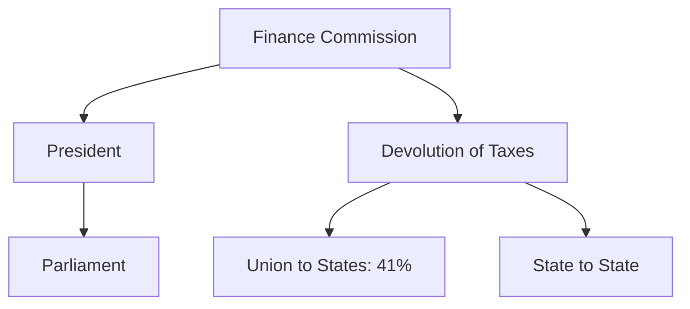

# LPG Impact & Regulatory Bodies

## 1. LPG Reforms (1991)
The New Economic Policy of 1991 introduced structural reforms to stabilize the Indian economy during a severe Balance of Payments crisis.
- **Liberalization**: Reducing government controls, abolishing the License Raj, and deregulating markets.
- **Privatization**: Transferring ownership/management of public sector enterprises (PSUs) to the private sector (disinvestment).
- **Globalization**: Integrating the national economy with the global economy through trade, FDI, and FII policies.

### Impact on the Economy:
- Foreign Exchange reserves surged significantly.
- IT and Service sectors saw massive exponential growth.
- **Agriculture** largely stagnated relative to services, leading to jobless growth patterns in rural sectors.

## 2. Major Regulatory Bodies

### SEBI (Securities and Exchange Board of India)
- **Established**: Originally formed in 1988 as a non-statutory body.
- **Statutory Status**: Granted in **1992** via the SEBI Act.
- **Function**: Regulates securities markets, protects investors, and promotes market development.

> [!WARNING]
> 💡 **PRELIMS TRAP**: Examiners often state SEBI was a statutory body since 1988. This is false. It became statutory only in 1992.

### IRDAI (Insurance Regulatory and Development Authority of India)
- **Established**: 1999 (Statutory body based on the Malhotra Committee report).
- **Function**: Protects policyholders' interests and regulates the insurance industry.

### PFRDA (Pension Fund Regulatory and Development Authority)
- **Established**: 2003 (Statutory status in 2013).
- **Function**: Regulates the National Pension System (NPS) and subscriber interests.

### CCI (Competition Commission of India)
- **Established**: 2003 (under the Competition Act, 2002, replacing the MRTP Act of 1969).
- **Function**: Prevents practices having adverse effects on competition and protects consumers.

## 3. Crucial Committees

| Committee | Sector Focus | Key Recommendation |
| :--- | :--- | :--- |
| **Narasimham (I & II)** | Banking Sector | Deregulation of interest rates, 4-tier banking structure, reducing CRR & SLR. |
| **Vijay Kelkar** | Taxation & PPP | Direct/Indirect tax reforms, revitalizing the Public-Private Partnership model. |
| **Raja Chelliah** | Tax Reforms | Lowering tax rates, broadening the tax base, introducing VAT. |
| **Rangarajan** | Disinvestment | Revamping PSU disinvestment, poverty estimation. |

## 4. Finance Commission (Article 280)
- **Nature**: Constitutional Body.
- **Appointment**: By the President of India every 5 years (or earlier).
- **Composition**: A Chairman and 4 other members.
- **Core Function**: Recommends the distribution of net proceeds of taxes between the Union and the States (Vertical Devolution) and among the States (Horizontal Devolution).
- **15th FC**: Chaired by N.K. Singh. Recommended a **41%** share for states (down from 42% due to the creation of J&K and Ladakh UTs).

