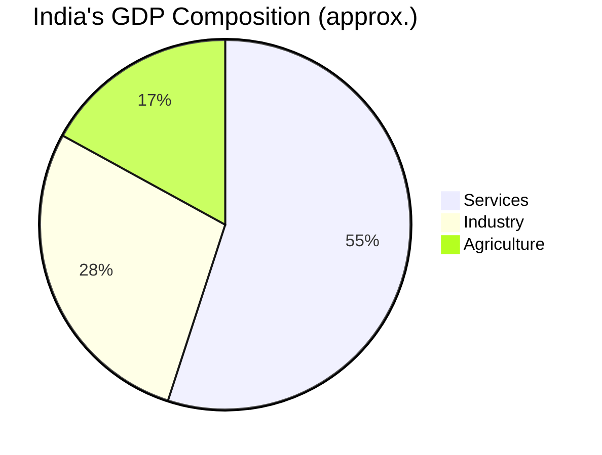

# Indian Economy — Basics & Economic Planning

## 1. National Income Concepts

| Term | Definition |
| :--- | :--- |
| **GDP (Gross Domestic Product)** | Total monetary value of all goods & services produced within a country's borders in a year. |
| **GNP (Gross National Product)** | GDP + Net Factor Income from Abroad (NFIA). Includes income of Indian citizens abroad. |
| **NNP (Net National Product)** | GNP minus Depreciation. Also called **National Income at Market Price**. |
| **NNP at Factor Cost** | NNP at Market Price minus (Indirect Taxes - Subsidies). This is **National Income**. |
| **Per Capita Income** | National Income ÷ Total Population. Indicator of average standard of living. |

> 💡 **EXAM TRAP**: GDP measures production **within borders**. GNP measures production by a country's **nationals** (regardless of location).

**Base Year for GDP Calculation in India**: Currently **2011-12** (revised from 2004-05).

---

## 2. Economic Planning in India

- **Planning Commission**: Established in **1950** by an executive resolution (not an Act of Parliament). Chaired by the Prime Minister.
- **NITI Aayog**: Replaced Planning Commission in **January 2015**. Focus shifted from top-down planning to cooperative federalism and policy think-tank role.

| Feature | Planning Commission | NITI Aayog |
| :--- | :--- | :--- |
| Established | 1950 | 2015 |
| Nature | Allocative (funds to states) | Advisory (no fund allocation) |
| States' role | Passive recipients | Active participants (Governing Council) |
| Approach | Top-down | Bottom-up / Cooperative Federalism |

### Five Year Plans (Key Plans):
- **1st Plan (1951-56)**: Agriculture focus; Harrod-Domar model. Succeeded in exceeding targets.
- **2nd Plan (1956-61)**: Nehru-Mahalanobis model; focus on **heavy industry** (PSUs). Bhilai, Durgapur, Rourkela steel plants.
- **8th Plan (1992-97)**: First plan under LPG reforms. Focus on privatisation, liberalisation.
- **12th Plan (2012-17)**: "Faster, More Inclusive and Sustainable Growth." Last formal Five Year Plan.
- **No 13th Plan**: Replaced by 3-year Action Plans + 7-year strategy under NITI Aayog.

---

## 3. Sectors of the Indian Economy

- **Primary Sector** (Agriculture, Mining): ~17% of GDP but employs ~45% of workforce — indicates low productivity.
- **Secondary Sector** (Manufacturing, Construction): ~28% of GDP.
- **Tertiary Sector** (Services, IT, Banking): ~55% of GDP — India's growth engine.

---

## 4. Monetary Policy

**Monetary Policy Committee (MPC)**:
- Established under the **RBI Act, 1934** (amended 2016).
- 6 members: 3 from RBI (Governor as Chair + 2 Deputy Governors/officials) + 3 from Government.
- Meets every **2 months** (bi-monthly).
- Target: Keep **CPI Inflation at 4%** (±2% tolerance band = 2%-6%).

### Key Policy Rates:

| Rate | Current (approx.) | Purpose |
| :--- | :--- | :--- |
| **Repo Rate** | ~6.25% | Rate at which RBI lends to commercial banks. |
| **Reverse Repo Rate** | Repo - 0.25% | Rate at which RBI borrows from commercial banks. |
| **CRR (Cash Reserve Ratio)** | ~4% | % of deposits banks must keep as cash with RBI. |
| **SLR (Statutory Liquidity Ratio)** | ~18% | % of deposits banks must hold in liquid assets (gold, govt. securities). |
| **MSF (Marginal Standing Facility)** | Repo + 0.25% | Emergency overnight lending window. |

---

## 5. Fiscal Policy

Administered by the **Ministry of Finance**.

- **Union Budget**: Annual financial statement (Article 112). Presented on **February 1** (changed from last day of February in 2017).
- **FRBM Act (Fiscal Responsibility & Budget Management), 2003**: Mandates fiscal discipline — limits the fiscal deficit to **3% of GDP**.
- **Fiscal Deficit** = Total Expenditure − Total Receipts (excluding borrowings). Indicates borrowing requirement.
- **Revenue Deficit** = Revenue Expenditure − Revenue Receipts.
- **Primary Deficit** = Fiscal Deficit − Interest Payments. Shows the current borrowing need excluding past debt servicing.

### Types of Taxes:

| Direct Taxes | Indirect Taxes |
| :--- | :--- |
| Paid directly by person (Income Tax, Corporate Tax) | Collected by intermediary (GST, Customs Duty) |
| Progressive in nature | Regressive — burden falls more on poor |
| Administered by CBDT | Administered by CBIC |

**GST (Goods & Services Tax)**: Implemented from **1 July 2017**. A dual GST system — Central GST (CGST) + State GST (SGST) on intra-state supplies; IGST on inter-state supplies.

---

## 6. Poverty & Unemployment

### Poverty Estimation Committees:
- **Tendulkar Committee (2009)**: Based on per-capita consumption expenditure. Rural: ₹816/month; Urban: ₹1000/month (2011-12 prices).
- **Rangarajan Committee (2014)**: Revised higher thresholds. Rural: ₹972/month; Urban: ₹1407/month.

### Types of Unemployment:
- **Structural**: Mismatch between skills demanded and available.
- **Cyclical**: Due to economic downturns.
- **Frictional**: Temporary, while switching jobs.
- **Seasonal**: In agriculture — unemployment during non-harvest months.
- **Disguised**: Workers appear employed but marginal productivity is zero (common in Indian agriculture).
