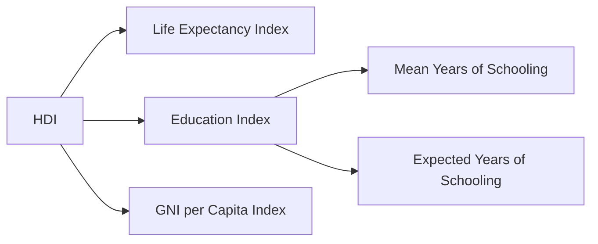

# National Income, Poverty & Employment

## 1. Measurement of National Income in India

**Central Statistics Office (CSO)** — now renamed **National Statistical Office (NSO)** under MoSPI — is responsible for compiling national accounts.

### Three Methods:
1. **Product / Output Method**: Sum of value added by each sector. Avoids double counting.
2. **Income Method**: Sum of factor incomes (wages, rent, interest, profit).
3. **Expenditure Method**: GDP = C + I + G + (X - M)
   - C = Private Consumption, I = Investment, G = Government Expenditure, X-M = Net Exports.

### GDP at Constant vs. Current Prices:
- **Current Prices (Nominal GDP)**: Uses prices of the current year — includes inflation effect.
- **Constant Prices (Real GDP)**: Uses base year prices (2011-12) — reflects actual growth.
- **GDP Deflator** = (Nominal GDP / Real GDP) × 100. Broader inflation measure than CPI.

---

## 2. Human Development Index (HDI)

Published by **UNDP** in the Human Development Report.

- **India's HDI Rank (2023 Report)**: 134 out of 193 countries.
- **Very High HDI**: Score > 0.800. India is in the **Medium HDI** category.

---

## 3. Poverty in India

### Key Concepts:
- **Absolute Poverty**: Inability to afford basic necessities (food, clothing, shelter).
- **Relative Poverty**: Being poor relative to others in the society.
- **Poverty Line**: A threshold income below which a person is considered poor.

### Committees & Their Estimates:
| Committee | Year | Criteria | Rural (₹/month) | Urban (₹/month) |
| :--- | :--- | :--- | :--- | :--- |
| **Lakdawala** | 1993 | Calorie norms | — | — |
| **Tendulkar** | 2009 | MPCE (consumption) | 816 | 1000 |
| **Rangarajan** | 2014 | Revised MPCE | 972 | 1407 |

> 💡 **EXAM TRAP**: The official poverty line in India is based on **consumption expenditure**, NOT income.

### Multidimensional Poverty Index (MPI):
- Published jointly by **UNDP and Oxford Poverty and Human Development Initiative (OPHI)**.
- Captures deprivation across **3 dimensions** and **10 indicators** (health, education, living standards).
- India has shown significant reduction in MPI poverty (from 55% in 2005-06 to ~15% in 2022-23).

---

## 4. Key Government Schemes for Poverty Alleviation

| Scheme | Focus | Ministry |
| :--- | :--- | :--- |
| **MGNREGS (2005)** | 100 days guaranteed rural employment | Rural Development |
| **PM Awas Yojana** | Housing for all (Urban & Rural) | Housing & Urban Affairs |
| **PM Jan Dhan Yojana (2014)** | Financial inclusion — bank accounts for all | Finance |
| **PM Kisan Samman Nidhi** | ₹6,000/year direct income transfer to farmers | Agriculture |
| **PMJJBY / PMSBY** | Life & accident insurance at low premium | Finance |
| **Ayushman Bharat (2018)** | ₹5 lakh health insurance for poor families | Health |

---

## 5. Employment & Labour Market

### Types of Workers (Census Classification):
- **Main Workers**: Worked for 183+ days in a year.
- **Marginal Workers**: Worked for less than 183 days.
- **Non-Workers**: Did not participate in any economic activity.

### Key Labour Indicators (PLFS — Periodic Labour Force Survey, by NSSO/NSO):
- **LFPR (Labour Force Participation Rate)**: % of working-age population in the labour force (employed + unemployed seeking work).
- **WPR (Worker Population Ratio)**: Employed persons as % of total population.
- **UR (Unemployment Rate)**: Unemployed (seeking work) as % of the Labour Force.

> 💡 **EXAM TRAP**: Women's LFPR in India is significantly lower than men's, especially in urban areas.

### Unemployment in India:
- **India's Unemployment Rate** (approx. 2024): ~7-8% (CMIE estimates).
- **Youth Unemployment Rate**: Much higher (~20%+ for 15-24 age group).
- Biggest challenge: **Informal Economy** — over 90% of India's workforce is in the unorganised sector with no social security.

### Key Acts:
- **Industrial Disputes Act, 1947**: Defines unfair labour practices and dispute resolution mechanisms.
- **Minimum Wages Act, 1948**: Consolidated under the **Code on Wages, 2019**.
- **Four Labour Codes (2019-20)**:
  1. Code on Wages
  2. Code on Industrial Relations
  3. Code on Social Security
  4. Code on Occupational Safety, Health & Working Conditions
