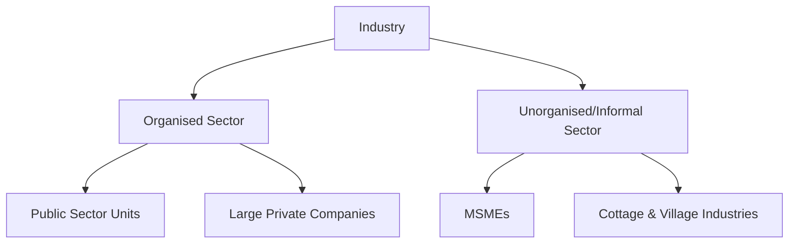

# Agriculture, Industry & Economic Reforms

## 1. Agriculture in India

### Key Stats:
- Contributes ~17% to GDP but employs ~45–50% of the workforce.
- India is the **world's largest producer** of: Milk, Pulses, Jute, Spices.
- India is the **world's 2nd largest producer** of: Rice, Wheat, Sugarcane, Cotton, Fruits & Vegetables.

### Green Revolution (1960s-70s):
- Introduced by **M.S. Swaminathan** (Father of Green Revolution in India) with Ford Foundation support.
- Key features: HYV (High Yielding Variety) seeds + Irrigation + Fertilisers.
- First covered **Punjab, Haryana, and Western UP**.
- Led to food self-sufficiency but caused regional disparities and ecological degradation.

### Agricultural Reforms:
- **Land Reforms**: Zamindari abolition (1950s), Land Ceiling Acts, Tenancy protection.
- **APMC Acts**: Agricultural Produce Market Committee — regulated mandis (markets). States have the power to amend.
- **Farm Laws (2020)**: Three controversial laws aimed at opening agricultural markets were **repealed in November 2021** following farmer protests.
- **MSP (Minimum Support Price)**: Price floor set by the government (recommended by CACP — Commission for Agricultural Costs and Prices) for 23 crops.

> 💡 **EXAM TRAP**: MSP is NOT a legal guarantee — it is only notified by the government. There is no legal obligation to purchase at MSP.

### Irrigation:
- **Canal Irrigation**: Major source in Punjab, Haryana, UP.
- **Tank Irrigation**: Dominant in AP, Telangana, Tamil Nadu.
- **Well/Borewell**: Dominant in Gujarat, Rajasthan, Maharashtra.
- **PM Krishi Sinchayee Yojana**: "More crop per drop" — micro-irrigation focus.

---

## 2. Industrial Development

### Industrial Policy:
- **Industrial Policy Resolution 1948**: Mixed economy approach. 4 categories of industries.
- **Industrial Policy Resolution 1956**: PSUs given dominant role. Called the "Economic Constitution of India."
- **New Industrial Policy 1991**: Abolished industrial licensing (except 6 industries), reduced public sector reservations, opened FDI.

### Public Sector Undertakings (PSUs):
- Originally a tool for "Commanding Heights" strategy.
- **Disinvestment**: Government selling its stake in PSUs.
  - **Strategic Disinvestment**: Government gives up management control (e.g., Air India to Tata Group, 2022).
  - **DIPAM** (Department of Investment and Public Asset Management): Nodal body for disinvestment.

### Make in India (2014):
- Initiative to turn India into a global manufacturing hub.
- Focus on 25 sectors including Electronics, Defence, Automobiles, Pharmaceuticals.
- Linked with **PLI Schemes (Production Linked Incentive)**: Incentives based on incremental sales.

---

## 3. Economic Reforms Since 1991

### Trigger for 1991 Reforms:
- **BOP Crisis**: India's forex reserves fell to just **2 weeks of import cover** by June 1991.
- India had to pledge **67 tonnes of gold** with the Bank of England and Bank of Japan as collateral.
- **Dr. Manmohan Singh** (Finance Minister under PM Narasimha Rao) presented the landmark budget.

### Three Pillars:

| Pillar | Key Measures |
| :--- | :--- |
| **Liberalisation** | Industrial delicensing; deregulation of capital markets; reduced import tariffs. |
| **Privatisation** | PSU disinvestment; private sector allowed in telecom, banking, airlines. |
| **Globalisation** | Rupee made convertible on current account (1994); FDI and FII openness. |

### WTO (World Trade Organisation):
- India is a founding member (1995).
- **Dispute Settlement Mechanism**: India has been both complainant and respondent in WTO disputes.
- **Food Security Exception**: India negotiated the right to subsidise food procurement for the PDS system under "peace clause."

### Special Economic Zones (SEZs):
- **SEZ Act, 2005**: Dedicated zones for export-oriented industries with tax concessions.
- Largest SEZs: Kandla (Gujarat), SEEPZ (Mumbai), Noida (UP), Vizag (AP).

---

## 4. Industry Structure in India

### MSMEs (Micro, Small & Medium Enterprises):
- Definition revised under **Atma Nirbhar Bharat Package (2020)** based on Investment + Turnover criteria.
- Contribute **~30% to GDP** and **~48% of exports**.
- **KVIC (Khadi and Village Industries Commission)**: Promotes rural cottage industries.
- **Udyam Registration Portal**: Online MSME registration platform.

### Industrial Corridors:
- **DMIC (Delhi-Mumbai Industrial Corridor)**: With Japanese collaboration; anchor project.
- **Chennai-Bengaluru Industrial Corridor**: Includes Krishnapatnam in Andhra Pradesh.
- **Vizag-Chennai Corridor** (East Coast Economic Corridor): Part of ECEC — crucial for AP.
