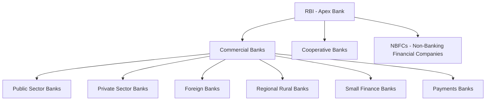

# Financial Institutions & Fiscal Policy

## 1. Reserve Bank of India (RBI)

- **Established**: **1 April 1935** under the Reserve Bank of India Act, 1934.
- **Nationalised**: 1 January 1949.
- **Headquarters**: Mumbai.
- **Governor**: Appointed by the Central Government.

### Functions of RBI:
1. **Monetary Authority**: Formulates and implements monetary policy via the MPC.
2. **Issuer of Currency**: Issues all banknotes except ₹1 coins & notes (issued by the Ministry of Finance).
3. **Banker to Banks**: Maintains CRR deposits of commercial banks; lender of last resort.
4. **Banker to the Government**: Manages government accounts, public debt, and issues government securities.
5. **Manager of Foreign Exchange**: Manages forex reserves; regulates forex transactions under FEMA.
6. **Regulator of Banking System**: Issues licences, conducts inspections.

> 💡 **EXAM TRAP**: ₹1 coins and ₹1 notes are issued by the **Government of India** (Ministry of Finance), NOT by the RBI. RBI issues all other denominations.

### Important Committees on Banking:
| Committee | Year | Key Output |
| :--- | :--- | :--- |
| Narasimham I | 1991 | 4-tier banking structure, reduce SLR/CRR |
| Narasimham II | 1998 | Banking sector reforms, NPA management |
| Raghuram Rajan | 2008 | Financial sector reforms in global context |
| P.J. Nayak | 2014 | Bank governance reforms |

---

## 2. Banking Structure in India

### Key Terms:
- **NPA (Non-Performing Asset)**: A loan where interest/principal has been unpaid for 90+ days. Major challenge for Indian banking.
- **IBC (Insolvency and Bankruptcy Code), 2016**: Time-bound resolution framework for NPAs (180+90 days).
- **SARFAESI Act (2002)**: Allows banks to seize and auction assets of defaulters without court intervention.

---

## 3. Capital Markets

### SEBI (Securities and Exchange Board of India):
- **Statutory body** since 1992 (SEBI Act, 1992).
- Regulates Primary Market (IPOs) and Secondary Market (Stock Exchanges).
- **BSE** (Bombay Stock Exchange): Oldest in Asia (est. 1875). Tracks **SENSEX** (30 companies).
- **NSE** (National Stock Exchange): Founded 1992. Tracks **NIFTY 50** (50 companies).

### Instruments:
- **Equity/Shares**: Ownership stake in a company.
- **Bonds/Debentures**: Debt instruments.
- **Mutual Funds**: Pooled investments managed by AMCs (Asset Management Companies).
- **G-Secs (Government Securities)**: Sovereign debt — considered risk-free.
- **T-Bills (Treasury Bills)**: Short-term (91, 182, 364 days) government securities.

---

## 4. Fiscal Policy & Union Budget

### Budget Classification:
| Type | Description |
| :--- | :--- |
| **Revenue Budget** | Revenue receipts (taxes, non-tax) vs. Revenue expenditure (salaries, subsidies, interest). |
| **Capital Budget** | Capital receipts (borrowings, disinvestment) vs. Capital expenditure (asset creation, loans given). |

### Key Deficit Indicators:
- **Revenue Deficit** = Revenue Expenditure − Revenue Receipts (government living beyond its means on current account).
- **Fiscal Deficit** = Total Expenditure − Total Receipts (excl. borrowings). **Primary source of government borrowing**.
- **Primary Deficit** = Fiscal Deficit − Net Interest Payments.
- **Capital Deficit** = Capital Expenditure − Capital Receipts (excl. borrowings).

### FRBM Act, 2003:
- **Fiscal Deficit Target**: 3% of GDP.
- **N.K. Singh Committee (2017)**: Recommended a debt-to-GDP ratio target of 60% (Centre 40% + States 20%) and creating a Fiscal Council.

---

## 5. Important Financial Institutions

| Institution | Role |
| :--- | :--- |
| **NABARD** (1982) | Development bank for agriculture and rural development. Refinances rural credit. |
| **SIDBI** (1990) | Small Industries Development Bank of India — for MSMEs. |
| **NHB** (1988) | National Housing Bank — promotes housing finance. |
| **EXIM Bank** (1982) | Financing, facilitating, and promoting foreign trade. |
| **MUDRA Bank** (2015) | Micro Units Development & Refinance Agency — loans to micro enterprises (up to ₹10 lakh). |

### MUDRA Loan Categories:
- **Shishu**: Loans up to ₹50,000.
- **Kishore**: ₹50,001 to ₹5 lakh.
- **Tarun**: ₹5 lakh to ₹10 lakh.
- **Tarun Plus** (2024): ₹10 lakh to ₹20 lakh.

---

## 6. Insurance Sector

- **IRDAI (Insurance Regulatory and Development Authority of India)**: Statutory body (1999).
- **LIC (Life Insurance Corporation)**: Largest life insurer; had a monopoly until 2000 (IRDAI opened sector).
- **GIC (General Insurance Corporation)**: Sole reinsurer in India. State-owned.
- **Pradhan Mantri Fasal Bima Yojana (PMFBY)**: Crop insurance scheme (2016). Premium: 2% (Kharif), 1.5% (Rabi), 5% (horticulture/commercial).

> 💡 **EXAM TRAP**: IRDAI is headquartered in **Hyderabad**, not Mumbai. It was initially in Delhi but shifted to Hyderabad in 2001.
