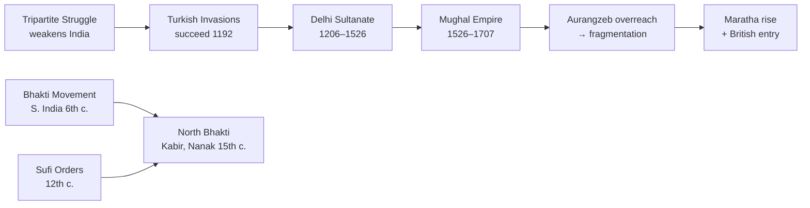

# Medieval India: Tripartite Struggle to the Mughal Zenith
> *The medieval period was not just a chain of conquests — it was India's great experiment in cultural synthesis, where Persian governance, Bhakti devotion, and indigenous traditions fused into something entirely new.*

**Sources Used:**
- NCERT Class 7 (Our Pasts II) — Chapters 1–9
- NCERT Class 11 Themes in Indian History Part II — Themes 5–9
- Satish Chandra — Medieval India

---

## The Big Picture

When the Gupta Empire collapsed in the 6th century, India fragmented into dozens of competing regional kingdoms. For the next six centuries, no single power could hold the subcontinent together. This era of the **Tripartite Struggle** — three great empires fighting endlessly for the symbolic city of Kanauj — defined early medieval India. Then came the Turks, the Afghans, and finally the Mughals, each layering new administrative ideas, new art forms, and new social tensions onto the subcontinent.

The medieval period is often misread as purely a time of invasion and destruction. In reality, it was also the age of the **Bhakti and Sufi movements** — grassroots spiritual revolutions that challenged caste hierarchy and religious orthodoxy from below, even as emperors fought above. Understanding this tension between political power and spiritual resistance is the key to understanding medieval India.

---

## 1. Early Medieval India: The Tripartite Struggle (8th–12th Century)

### The Fight for Kanauj

For two centuries, three great powers fought for control of **Kanauj** — not because it was economically valuable, but because it was the symbolic seat of sovereignty in North India. Whoever held Kanauj was acknowledged as the paramount power. This exhausting conflict between the **Gurjara-Pratiharas** (Northwest), the **Palas** (Bengal/Bihar), and the **Rashtrakutas** (Deccan) drained all three dynasties and left India unable to resist the Turkish invasions that followed.

The Rashtrakutas were arguably the most powerful of the three — founded by **Dantidurga** with capital at **Malkhed**, they built the magnificent **Kailashnath Temple at Ellora** (under Krishna I), a monolithic rock-cut marvel that stands as medieval India's greatest architectural achievement.

> 🔑 **Key Insight:** The Tripartite Struggle is the reason India was so vulnerable to Mahmud of Ghazni's raids (997–1027 CE). Three exhausted, depleted empires could not mount a unified defense.

### The Chola Empire: Administration as Art (9th–13th Century)

While the north bled, the south flourished. The **Cholas** — revived by **Vijayalaya** — built one of the most sophisticated administrative systems in Indian history. **Rajaraja I** constructed the towering **Brihadeshwara Temple** at Thanjavur, and **Rajendra I** launched a remarkable naval expedition to Southeast Asia, establishing Indian commercial and cultural dominance across the Indian Ocean.

What made the Chola system extraordinary was its local self-governance. The empire was divided into **Mandalams → Valanadu → Nadu → Kurram**. At the village level, **Ur** (general assemblies) and **Sabha** (brahmin village councils) handled local affairs with elected committees.

> 📌 **Exam Note:** The **Uttaramerur Inscription** (from Parantaka I's reign) gives a detailed description of the election system for village committees — it is the earliest evidence of democratic local governance in India.

---

## 2. The Delhi Sultanate (1206–1526 CE)

### Five Dynasties, Three Centuries

The Delhi Sultanate was not one empire but a succession of five ruling dynasties, each bringing new ideas and facing new crises. The **Mamluk (Slave) Dynasty** was founded by **Qutbuddin Aibak** after Muhammad of Ghur's assassination, but it was **Iltutmish** who truly consolidated the Sultanate — shifting the capital to Delhi, introducing the **silver tanka** and **copper jital** coins, and creating the **Turkan-i-Chahalgani** (Corps of Forty nobles) to manage the empire.

| Dynasty | Period | Founder | Key Ruler |
|---------|--------|---------|-----------|
| Mamluk (Slave) | 1206–1290 | Qutbuddin Aibak | Iltutmish, Balban |
| Khalji | 1290–1320 | Jalaluddin Khalji | Alauddin Khalji |
| Tughlaq | 1320–1414 | Ghiyasuddin Tughlaq | Muhammad bin Tughlaq, Firuz Shah |
| Sayyid | 1414–1451 | Khizr Khan | — |
| Lodi | 1451–1526 | Bahlul Lodi | Ibrahim Lodi (last) |

> ⚠️ **Exam Trap:** **Iltutmish** introduced the Iqta system, NOT Alauddin Khalji. Iltutmish is called the *real* founder of the Delhi Sultanate — Aibak merely established it.

### Power Experiments: Balban to Alauddin

**Balban** (1266–1286) responded to the weakening of central authority with sheer terror and Persian court ceremony. He enforced **Sijda** (prostration before the king) and **Paibos** (kissing the king's feet), rejecting the traditional Turkish chief-among-equals approach. His "Blood and Iron" policy crushed all rebellion but left a brittle state.

**Alauddin Khalji** (1296–1316) was the Sultanate's most interventionist ruler. Facing constant Mongol invasions, he built a huge standing army — and to maintain it without bankrupting the treasury, he introduced price control markets in Delhi. Three separate markets (for grain, cloth, and cattle/horses) each run by a **Shahna-i-Mandi** kept prices artificially low. The **Dagh** (branding of horses) and **Chehra** (descriptive rolls of soldiers) eliminated corruption in military recruitment.

**Muhammad bin Tughlaq** had brilliant ideas executed disastrously. His **Transfer of Capital** from Delhi to Daulatabad (Devagiri) to better control the Deccan caused mass exodus and suffering. His **Token Currency** — replacing silver coins with brass/copper tokens — collapsed when people forged coins freely.

> 🔑 **Key Insight:** The Sultanate's great administrative paradox — the stronger they tried to centralize, the more rebellions they faced in the periphery. Alauddin came closest to solving this, but his systems died with him.

---

## 3. The Mughal Empire (1526–1707 CE)

### Foundation and Consolidation

**Babur** defeated Ibrahim Lodi at the **First Battle of Panipat (1526)** using artillery and flanking tactics that the Afghans had never encountered. His grandson **Akbar** (1556–1605) transformed a military occupation into a genuine empire through a policy of **Sulh-i-Kul** (peace with all) — incorporating Rajput chiefs as partners rather than subjects, abolishing the **Jizya** tax on non-Muslims, and creating a unified administrative system.

The **Mansabdari system** was Akbar's master innovation. Every official received a rank (**Mansab**) with two numbers: **Zat** (personal rank, determined salary) and **Sawar** (number of cavalry the official must maintain). This prevented hereditary military power — unlike European feudalism, no Mansabdar could pass his rank to his son.

**Raja Todar Mal** designed the **Zabti system** of land revenue — classifying land as Polaj (cultivated annually), Parauti (fallow), Chachar (cultivated once in 3–4 years), or Banjar (uncultivated). The **Dahsala** fixed tax at one-third of the average produce over ten years, providing predictability for both farmers and the state.

> ⚠️ **Exam Trap:** The **Rupiya** (silver coin precursor to the modern Rupee) and the **Grand Trunk Road** were built by **Sher Shah Suri** (1540–1555) during the Sur Interregnum, NOT by Akbar or any Mughal.

### The Aurangzeb Paradox

**Aurangzeb** (1658–1707) expanded the empire to its greatest territorial extent — but his reign planted the seeds of its collapse. Re-imposing Jizya, destroying temples, and waging a 27-year war against the **Marathas** in the Deccan drained the treasury and alienated the empire's non-Muslim majority. When he died in 1707, the Maratha confederacy was stronger than when he began, and the empire began fragmenting almost immediately.

> 🔑 **Key Insight:** Akbar built the empire on inclusion; Aurangzeb destroyed it through exclusion. The Mughal collapse teaches that no multiethnic empire can survive on the religious loyalty of only one community.

---

## 4. Bhakti and Sufi Movements: The Cultural Revolution Below

### Two Streams of Devotion

While emperors rose and fell, a spiritual revolution was reshaping Indian society from the ground up. The **Bhakti movement** in the South began with the **Alvars** (Vaishnava) and **Nayanars** (Shaiva) — Tamil poet-saints who rejected Sanskrit's brahmin monopoly and sang directly to God in the Tamil language. Philosophers like **Shankaracharya** (Advaita Vedanta) and **Ramanuja** (Vishishtadvaita) gave intellectual depth to these devotional currents.

In the North, the movement radicalized. **Kabir** — a weaver who rejected both the idol worship of Hinduism and the orthodoxy of Islam — sang of a formless God accessible to all. **Guru Nanak** founded what became Sikhism. **Mirabai** wrote ecstatic devotional poetry defying royal convention. **Tulsidas** composed the **Ramcharitmanas** in Awadhi, making the Ramayana accessible to common people.

The **Sufi movement** was Islam's mystical counterpart — focused on direct personal experience of the divine through love, music, and poetry. The **Chishti order** (Moinuddin Chishti, Nizamuddin Auliya) deliberately avoided state patronage and lived among common people. The **Suhrawardi order** accepted royal wealth and official positions.

| Movement | Tradition | Key Figures | Distinctive Feature |
|----------|-----------|-------------|---------------------|
| Bhakti (South) | Hindu | Alvars, Nayanars, Ramanuja | Tamil language devotion, anti-caste |
| Bhakti (North) | Hindu/Syncretic | Kabir, Nanak, Mirabai, Tulsidas | Vernacular poetry, formless God |
| Sufism — Chishti | Islamic | Moinuddin Chishti, Nizamuddin Auliya | Avoided state; close to poor |
| Sufism — Suhrawardi | Islamic | Bahauddin Zakariya | Accepted state patronage |

---

## The Andhra Connection

The medieval period produced some of Andhra's most significant dynasties and cultural monuments.

> 🏛️ **AP Exam Focus:** The **Kakatiya Dynasty** (capital: Warangal) flourished while the Delhi Sultanate was rising. **Rani Rudramadevi** — one of India's rare female rulers — was visited by **Marco Polo**, who praised the **Motupalli port** in the Krishna district. The Kakatiyas built the **Warangal Fort** and the famous **Thousand Pillar Temple**.

The **Vijayanagara Empire** (1336–1646 CE) was the great defender of Hindu culture against Sultanate expansion. Its territory included all of Rayalaseema, and it patronized Telugu literature extensively. The **Lepakshi temple** at Anantapur (famous for the hanging pillar and Nandi sculpture) is a prime APPSC cultural question source.

After the Battle of Talikota (1565) destroyed Vijayanagara, the **Qutb Shahis of Golconda** emerged as the dominant power. They founded Hyderabad (1591), built the **Charminar** and **Golconda Fort**, and — critically — **Ibrahim Quli Qutb Shah** profoundly patronized Telugu literature, earning the title *Abhinava Bhoja*.

---

## Connecting the Dots

The medieval period makes sense only as a chain of responses. The **Tripartite Struggle** weakened India's defenses → **Turkish invasions** succeeded where Persian and Arab ones had failed → the **Delhi Sultanate** introduced a new administrative vocabulary (Iqta, Mansab, market controls) that the **Mughals** refined and expanded → **Aurangzeb's overreach** created the vacuum that the **Marathas and British** would fill.

Culturally, every political crisis produced a spiritual counter-response. The Bhakti and Sufi movements were not coincidentally contemporary with political fragmentation — they were *responses* to it, offering ordinary people identity and dignity independent of which dynasty happened to be winning.

---

## Quick Revision

### Timeline

| Period | Key Event |
|--------|-----------|
| 606–647 CE | Harsha's empire — last pre-medieval unified North India |
| 8th–12th c. | Tripartite Struggle (Pratiharas, Palas, Rashtrakutas) |
| 997–1027 | Mahmud of Ghazni's 17 raids |
| 1192 | Second Battle of Tarain — Muhammad of Ghur defeats Prithviraj III |
| 1206 | Delhi Sultanate founded (Qutbuddin Aibak) |
| 1296–1316 | Alauddin Khalji — market reforms, Mongol repulsion |
| 1336 | Vijayanagara Empire founded |
| 1398 | Timur's invasion — Sultanate never recovers fully |
| 1526 | First Battle of Panipat — Mughal Empire begins |
| 1556–1605 | Akbar — Sulh-i-Kul, Mansabdari, Zabti |
| 1565 | Battle of Talikota — Vijayanagara falls |
| 1658–1707 | Aurangzeb — empire's peak and beginning of decline |

### Core Facts
- Kanauj was the prize of the Tripartite Struggle — it was symbolic sovereignty
- Iltutmish: real founder of Sultanate, introduced Iqta system
- Balban: Sijda + Paibos + Blood and Iron policy
- Alauddin: price control markets, Dagh (horse branding), Chehra (soldier rolls)
- Muhammad bin Tughlaq: capital transfer Delhi→Daulatabad, Token Currency (both failed)
- Sher Shah Suri introduced the Rupiya and Grand Trunk Road (NOT Mughals)
- Akbar: Mansabdari (Zat + Sawar), Zabti revenue (Todar Mal), Sulh-i-Kul, removed Jizya
- Uttaramerur Inscription: Chola local elections (Parantaka I's reign)
- Chishtis: avoided state patronage; Suhrawardis: accepted it
- Kakatiyas: Warangal Fort, Motupalli port, Rani Rudramadevi (Marco Polo visited)
- Vijayanagara: Lepakshi temple, patronized Telugu literature
- Qutb Shahis: Charminar (1591), Ibrahim Quli — Abhinava Bhoja

### Common Exam Traps

| ❌ Wrong Belief | ✅ Correct Fact |
|----------------|----------------|
| Alauddin Khalji introduced the Iqta system | **Iltutmish** introduced the Iqta system |
| Akbar built the Grand Trunk Road and Rupiya | **Sher Shah Suri** built them (Sur Interregnum) |
| Babur was a Mughal from Central Asia | Babur was a **Timurid** (descended from Timur and Genghis Khan) |
| Aurangzeb was the greatest Mughal | Greatest territory, but his policies caused the empire's collapse |
| Bhakti movement was against Islam | It challenged **brahmin monopoly and caste hierarchy** — not anti-Muslim |

---

## Think About It
*If the Bhakti and Sufi saints preached unity, equality, and love across religious boundaries — why did medieval India still see communal conflicts? What does this tell us about the relationship between popular spirituality and political power?*
