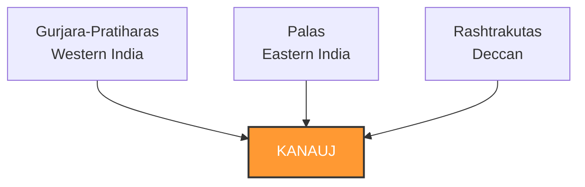
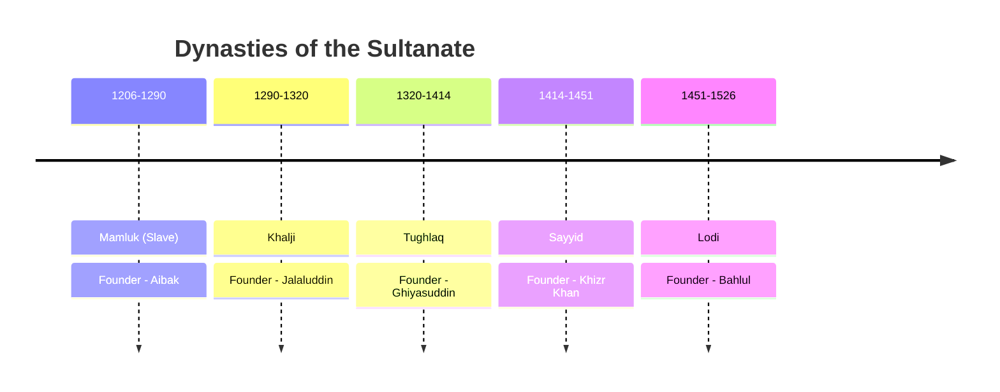

# Medieval India: Tripartite Struggle to Decline of Mughals
**Covers:** G2 Screening History | G1 Mains Paper 2 | G2 Paper 1  
**Sources:** NCERT Class 7 (Our Pasts-II), NCERT Class 11 Part 1 (Themes in Indian History), Satish Chandra (Medieval India)

---

## 1. Early Medieval Period (~8th to 12th Century)

### The Tripartite Struggle
Fought for control over **Kanauj** (the symbol of sovereignty in North India). It was an exhaustive conflict spanning two centuries.

Deep Dive: Rashtrakuta Power

Founded by <b>Dantidurga</b> (capital: Malkhed), the Rashtrakutas were the most powerful and longest-lasting among the three competing empires. Notably, the stunning monolithic <i>Kailashnath Temple at Ellora</i> was built by Rashtrakuta king Krishna I.

### The Chola Administration (9th–13th Century)
The Cholas (founded by Vijayalaya) achieved extreme maritime and administrative success.

| Aspect | Detail |
|--------|--------|
| **Greatest Kings** | **Rajaraja I** (Brihadeshwara Temple) & **Rajendra I** (Naval expedition to SE Asia) |
| **Provincial Admin** | Mandalam (province) → Valanadu → Nadu (district) → Kurram (villages) |
| **Local Government** | **Ur** (general assembly) and **Sabha** (brahmin settlements) |

> 🧨 **PRELIMS TRAP:** The *Uttaramerur Inscription* (issued by Parantaka I) specifically provides elaborate details of the **election system to village committees** (Sabha), uniquely highlighting early democratic-style administration.

---

## 2. The Delhi Sultanate (1206–1526 CE)

### Sequence of Dynasties
*Mnemonic Anchor: **S**ome **K**ings **T**hrow **S**weet **L**emonades*

> 💡 **EXAM TRAP:** **Iltutmish** introduced the *Iqta system* and the *Turkan-i-Chahalgani* (Corps of Forty), **NOT** Alauddin Khalji or Akbar. Iltutmish is considered the *real* founder because he shifted the capital from Lahore to Delhi.

### Crucial Sultanate Policies
- **Balban's Prestige**: Implemented Persian customs *Sijda* (prostration) and *Paibos* (feet-kissing), backed by a ruthless "Blood and Iron" policy.
- **Alauddin's Economic Control**: Set up three distinct markets in Delhi under a *Shahna-i-Mandi*. Introduced *Dagh* (branding horses) and *Chehra* (descriptive soldier rolls) to kill corruption.
- **Muhammad bin Tughlaq's Experiments**: Devised the ill-fated Transfer of Capital (Delhi to Daulatabad) and the disastrous Token Currency system.

---

## 3. The Mughal Empire (1526–1707 CE)

The Mughals drastically centralized the Indian subcontinent.

### The Mansabdari System (Akbar)

Understanding Mansab, Zat, and Sawar

Every official was given a rank (<b>Mansab</b>) which determined their hierarchy, salary, and military responsibilities.
<ul>
<li><b>Zat:</b> Indicated the personal rank and fixed the personal salary.</li>
<li><b>Sawar:</b> Indicated the number of cavalrymen (horsemen) the Mansabdar was required to maintain for the Emperor.</li>
</ul>
This was designed by Akbar to ensure nobles did not become hereditary, contrasting deeply with European feudalism.

### Land Revenue (Zabti System)
Orchestrated by **Todar Mal**, land was categorized (Polaj, Parauti, Chachar, Banjar). The tax was fixed at 1/3rd of the average produce over a 10-year period (Dahsala).

> 🧨 **PRELIMS TRAP:** **Rupiya** (the silver coin precursor to the modern Rupee) and the **Grand Trunk Road** were established by **Sher Shah Suri** during the Sur Interregnum (1540–1555), NOT by Akbar.

---

## 4. Synthesis: Bhakti & Sufi Movements
The Medieval period wasn't purely a political clash; it saw ultimate cultural syncretism.

| Movement | Key Characteristics | Famous Saints / Orders |
|----------|---------------------|------------------------|
| **Bhakti (South)** | Alvars (Vishnu) & Nayanars (Shiva). Casteless. | Shankaracharya (Advaita), Ramanuja (Vishishtadvaita) |
| **Bhakti (North)** | Vernacular languages, strict rejection of orthodox rituals. | Kabir, Guru Nanak, Mirabai, Tulsidas |
| **Sufism** | Islamic mysticism focusing on divine love. | **Chishtis** (avoided state patronage) vs **Suhrawardis** (accepted state wealth) |

---

## 5. APPSC Context: Andhra Linkages 
Make sure these local histories are memorized for Group 1 Mains.
- **Kakatiya Dynasty**: Contemporary with the early Delhi Sultanate. Marco Polo famously visited the Motupalli port during Rani Rudramadevi’s reign.
- **Qutb Shahis of Golconda**: Emerged post-Bahmani collapse. Founded Hyderabad, built Charminar. Ibrahim Quli Qutb Shah profoundly patronized Telugu literature.
- **Vijayanagara Empire**: Core territory included Rayalaseema. Famous architecture like the Lepakshi temple (Anantapur, AP) remains a prime APPSC cultural question source.

---
*Premium Notes Layout Standardized.*
